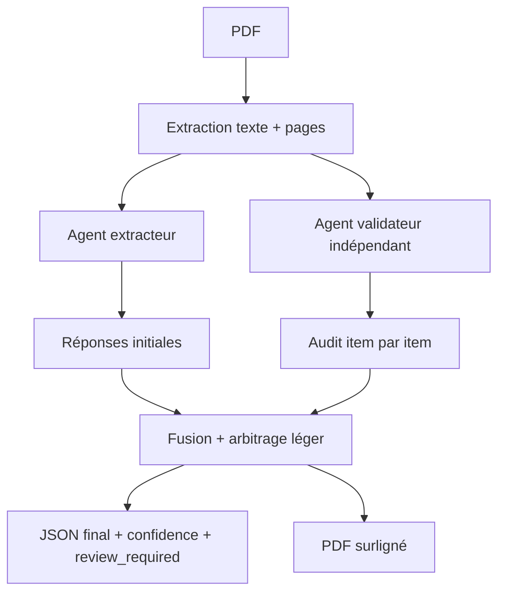

# Review Extraction

MVP pour extraire automatiquement des paramètres méthodologiques d'articles PDF dans une revue systématique, avec validation par un second agent indépendant.

Le pipeline produit:

- un JSON structuré par article et par question;
- un CSV synthèse pour la revue;
- une confiance finale;
- les preuves textuelles utilisées;
- un indicateur `review_required`;
- un PDF surligné lorsque les citations peuvent être retrouvées dans le document.

## Installation

```powershell
python -m venv .venv
.\.venv\Scripts\Activate.ps1
pip install -e ".[dev,api]"
copy .env.example .env
```

Ajoutez votre clé dans `.env`:

```text
OPENAI_API_KEY=sk-...
```

## Usage CLI

```powershell
review-extract .\pdfs --out .\outputs
```

Ou pour un seul PDF:

```powershell
review-extract .\paper.pdf --out .\outputs
```

Options utiles:

```powershell
review-extract .\pdfs --out .\outputs --no-highlight
review-extract .\pdfs --out .\outputs --model gpt-5.5 --validator-model gpt-5.5
```

## API locale

```powershell
uvicorn review_extraction.api:app --reload
```

Puis téléverser un PDF:

```powershell
curl -X POST "http://127.0.0.1:8000/extract" -F "file=@paper.pdf" -F "output_dir=outputs"
```

## Architecture



Le validateur reçoit les passages et les réponses de l'extracteur, mais doit refaire l'analyse comme critique indépendant. Une révision humaine est exigée si les agents divergent, si la confiance est basse ou si les preuves sont insuffisantes.
