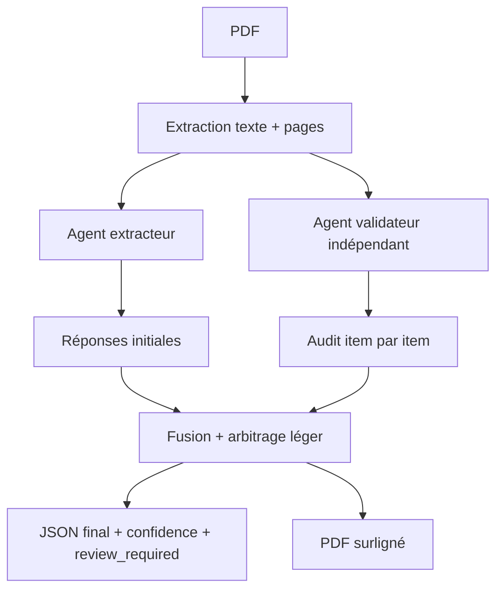

# Review Extraction

MVP pour extraire automatiquement des paramètres méthodologiques d'articles PDF dans une revue systématique, avec validation par un second agent indépendant.

Le pipeline produit:

- un screening full paper inclusion/exclusion avant extraction;
- une lecture ciblee des passages utiles pour reduire les tokens envoyes a l'API;
- un JSON de screening par article;
- un fichier Excel `summary.xlsx` avec feuilles `Summary`, `Screening`, `Extraction` et `Review required`;
- un JSON structuré par article et par question;
- un CSV synthèse pour la revue;
- une confiance finale;
- les preuves textuelles utilisées;
- un indicateur `review_required`;
- un PDF surligné lorsque les citations peuvent être retrouvées dans le document.

La phase amont applique la grille:

- population: inclure les populations humaines saines ou non saines; exclure les études animales;
- outcome: inclure cinématique/posture de l'épaule; exclure le membre supérieur sans épaule;
- study design: inclure recherche prospective primaire; exclure revues, analyses secondaires/rétrospectives et proceedings;
- langue: inclure les articles en anglais.

L'extraction détaillée est lancée seulement si le screening final est `include` sans révision humaine requise. Les articles exclus ou incertains gardent un `*.screening.json`, une ligne dans `summary.csv`, et un PDF surligné des preuves de screening si le surlignage est activé.

## Lecture ciblee pour reduire les tokens

Avant chaque appel OpenAI, le pipeline extrait le texte par page puis construit un contexte cible:

- screening: pages d'abstract/methodes et passages contenant population, outcome, study design, shoulder, human/animal, review/proceedings;
- extraction: passages contenant methodes, instrumentation, marqueurs/capteurs, segments thorax/clavicle/scapula/humerus, coordinate systems, ISB, Euler sequences, translations/rotations;
- validation: le second agent reste independant et recoit un contexte cible plus large que le premier agent.

Si le screening cible reste `uncertain` ou demande `review_required`, le pipeline relance uniquement le screening avec le contexte complet du PDF. Cela garde une securite pour les cas difficiles sans refaire une lecture complete sur les articles simples.

La console affiche le volume envoye:

```text
[1/12] article.pdf: target screening context: 18000/52000 chars (35%), pages 1, 2, 4, 5
[1/12] article.pdf: target extraction context: 29000/52000 chars (56%), pages 1, 3, 4, 5, 6
```

## Suivi tokens et couts

Chaque reponse OpenAI contient normalement un compteur `usage`. Le pipeline l'enregistre dans le JSON final de l'article et l'affiche dans la console:

```text
[1/12] article.pdf: usage screening: model=gpt-5.5, input=18432, output=912, total=19344, cost=$0.119520
[1/12] article.pdf: article usage: input=62100, output=8420, total=70520, cost=$0.587300
```

Les exports ajoutent:

- `summary.csv`: colonnes `usage_input_tokens`, `usage_output_tokens`, `usage_total_tokens`, `usage_estimated_cost_usd`;
- `summary.xlsx`: feuille `Usage` avec une ligne par etape (`screening`, `screening_validation`, `extraction`, `extraction_validation`).

Pour calculer les couts, ajoute les tarifs actuels du modele dans `.env` en USD par 1M tokens:

```text
OPENAI_INPUT_COST_PER_1M=
OPENAI_OUTPUT_COST_PER_1M=
OPENAI_VALIDATOR_INPUT_COST_PER_1M=
OPENAI_VALIDATOR_OUTPUT_COST_PER_1M=
```

Si ces variables sont vides, le pipeline rapporte les tokens seulement.

## Installation

```powershell
conda env create -f environment.yml
conda activate review-extraction
copy .env.example .env
```

Ajoutez votre clé dans `.env`:

```text
OPENAI_API_KEY=sk-...
```

## Usage CLI

```powershell
review-extract .\pdfs --out .\outputs
```

Ou pour un seul PDF:

```powershell
review-extract .\paper.pdf --out .\outputs
```

Options utiles:

```powershell
review-extract .\pdfs --out .\outputs --no-highlight
review-extract .\pdfs --out .\outputs --model gpt-5.5 --validator-model gpt-5.5
```

## Reprise sans relancer l'IA

Par defaut, la CLI reutilise les fichiers deja presents dans `outputs`:

- si `article.json` existe, aucun appel OpenAI n'est refait pour cet article;
- si seul `article.screening.json` existe, le screening est reutilise et le pipeline reprend a l'extraction detaillee si elle est autorisee;
- les PDF surlignes, `summary.csv` et `summary.xlsx` peuvent etre regeneres a partir des JSON existants.

Commande de reprise:

```powershell
review-extract .\pdf_input --out .\outputs
```

La console affiche la progression:

```text
Found 12 PDF(s) to process.
[1/12] article.pdf: reuse existing JSON: article.json
[1/12] article.pdf: done
[2/12] autre_article.pdf: extract PDF text
[2/12] autre_article.pdf: screen full paper
```

Pour forcer une nouvelle analyse OpenAI et ignorer les JSON existants:

```powershell
review-extract .\pdf_input --out .\outputs --force
```

## Benchmark de modeles

Les JSON actuels dans `outputs` peuvent servir de reference 5.5 pour comparer des modeles candidats:

```powershell
review-model-benchmark .\pdf_input --reference-out .\outputs --out .\benchmark_outputs --models gpt-5.4 gpt-5.4-mini
```

Pour tester d'abord sur quelques articles:

```powershell
review-model-benchmark .\pdf_input --reference-out .\outputs --out .\benchmark_outputs --models gpt-5.4 gpt-5.4-mini --limit 3
```

Les resultats sont ecrits dans:

- `benchmark_outputs\benchmark_summary.csv`
- `benchmark_outputs\benchmark_articles.csv`
- `benchmark_outputs\benchmark_disagreements.csv`
- `benchmark_outputs\benchmark.xlsx`

Si les sorties candidates existent deja, elles sont reutilisees. Pour comparer sans aucun appel OpenAI:

```powershell
review-model-benchmark .\pdf_input --reference-out .\outputs --out .\benchmark_outputs --models gpt-5.4 gpt-5.4-mini --compare-only
```

## Tests

Les tests unitaires utilisent `unittest`, donc ils peuvent tourner sans `pytest`:

```powershell
python -B -m unittest discover -s tests -v
```

## API locale

```powershell
uvicorn review_extraction.api:app --reload
```

Puis téléverser un PDF:

```powershell
curl -X POST "http://127.0.0.1:8000/extract" -F "file=@paper.pdf" -F "output_dir=outputs"
```

## Architecture



Le validateur reçoit les passages et les réponses de l'extracteur, mais doit refaire l'analyse comme critique indépendant. Une révision humaine est exigée si les agents divergent, si la confiance est basse ou si les preuves sont insuffisantes.
