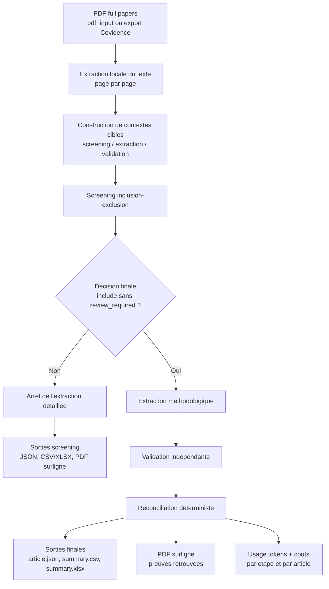
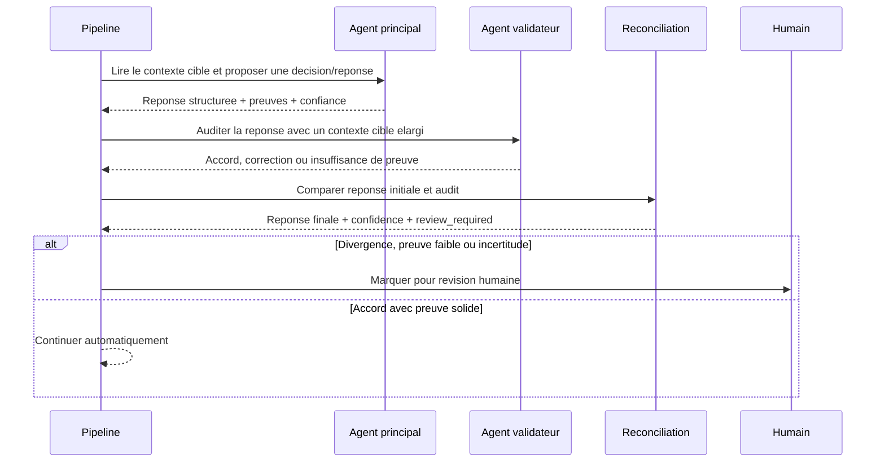
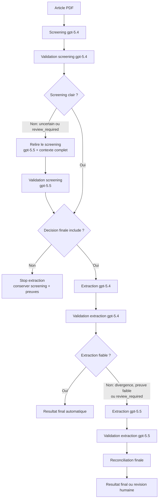
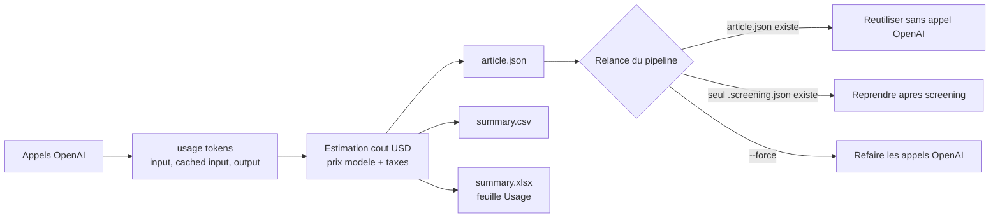

# Review Extraction

MVP pour extraire automatiquement des paramètres méthodologiques d'articles PDF dans une revue systématique, avec validation par un second agent indépendant.

Le pipeline produit:

- un screening full paper inclusion/exclusion avant extraction;
- une lecture ciblee des passages utiles pour reduire les tokens envoyes a l'API;
- une extraction adaptative qui envoie seulement les blocs methodologiques pertinents a l'IA;
- un JSON de screening par article;
- un fichier Excel `summary.xlsx` avec feuilles `Summary`, `Screening`, `Extraction` et `Review required`;
- un JSON structuré par article et par question;
- un CSV synthèse pour la revue;
- une confiance finale;
- les preuves textuelles utilisées;
- un indicateur `review_required`;
- un PDF surligné lorsque les citations peuvent être retrouvées dans le document.

La phase amont applique la grille:

- population: inclure les populations humaines saines ou non saines; exclure les études animales;
- outcome: inclure cinématique/posture de l'épaule; exclure le membre supérieur sans épaule;
- study design: inclure recherche prospective primaire; exclure revues, analyses secondaires/rétrospectives et proceedings;
- langue: inclure les articles en anglais.

L'extraction détaillée est lancée seulement si le screening final est `include` sans révision humaine requise. Les articles exclus ou incertains gardent un `*.screening.json`, une ligne dans `summary.csv`, et un PDF surligné des preuves de screening si le surlignage est activé.

## Lecture ciblee pour reduire les tokens

Avant chaque appel OpenAI, le pipeline extrait le texte par page puis construit un contexte cible:

- screening: pages d'abstract/methodes et passages contenant population, outcome, study design, shoulder, human/animal, review/proceedings;
- extraction: passages contenant methodes, instrumentation, marqueurs/capteurs, segments thorax/clavicle/scapula/humerus, coordinate systems, ISB, Euler sequences, translations/rotations;
- validation: le second agent reste independant et recoit un contexte cible plus large que le premier agent.

Si le screening cible reste `uncertain` ou demande `review_required`, le pipeline relance uniquement le screening avec le contexte complet du PDF. Cela garde une securite pour les cas difficiles sans refaire une lecture complete sur les articles simples.

La console affiche le volume envoye:

```text
[1/12] article.pdf: target screening context: 18000/52000 chars (35%), pages 1, 2, 4, 5
[1/12] article.pdf: target extraction context: 29000/52000 chars (56%), pages 1, 3, 4, 5, 6
```

## Suivi tokens et couts

Chaque reponse OpenAI contient normalement un compteur `usage`. Le pipeline l'enregistre dans le JSON final de l'article et l'affiche dans la console:

```text
[1/12] article.pdf: usage screening: model=gpt-5.5, input=18432, cached_input=1024, output=912, total=19344, cost=$0.119520
[1/12] article.pdf: usage extraction: model=gpt-5.4, input=28120, cached_input=0, output=4210, total=32330, cost=$0.184300, elapsed=42.31s
[1/12] article.pdf: article usage: input=62100, cached_input=2048, output=8420, total=70520, cost=$0.587300, ai_elapsed=135.42s, processing=141.03s
```

Les exports ajoutent:

- `summary.csv`: colonnes `usage_input_tokens`, `usage_cached_input_tokens`, `usage_output_tokens`, `usage_total_tokens`, `usage_estimated_cost_usd`, `ai_elapsed_seconds`, `processing_seconds`;
- `summary.xlsx`: feuille `Usage` avec une ligne par etape (`screening`, `screening_validation`, `extraction`, `extraction_validation`) et son `elapsed_seconds`.

Les couts sont calcules automatiquement a partir du modele utilise (`gpt-5.5`, `gpt-5.4`, `gpt-5.4-mini`, etc.) avec les tarifs OpenAI Standard / Short context et les taxes. Par defaut, le taux de taxe est celui du Quebec: 14.975%.

```text
OPENAI_TAX_RATE=0.14975
```

Les variables `OPENAI_*_COST_PER_1M` existent encore comme overrides optionnels si les prix changent, mais elles peuvent rester vides.

Pour voir la table de prix utilisee par le code:

```powershell
review-pricing
```

## Installation

```powershell
conda env create -f environment.yml
conda activate review-extraction
copy .env.example .env
```

Ajoutez votre clé dans `.env`:

```text
OPENAI_API_KEY=sk-...
```

## Usage CLI

```powershell
review-extract .\pdfs --out .\outputs
```

Ou pour un seul PDF:

```powershell
review-extract .\paper.pdf --out .\outputs
```

Options utiles:

```powershell
review-extract .\pdfs --out .\outputs --no-highlight
review-extract .\pdfs --out .\outputs --model gpt-5.4 --validator-model gpt-5.4 --fallback-model gpt-5.5 --fallback-validator-model gpt-5.5
review-extract .\pdf_input --out .\outputs_hybrid_10 --limit 10 --workers 2 --no-highlight
```

Pour estimer le cout et le temps de l'approche hybride sur 10 articles sans surlignage:

```powershell
review-extract .\pdf_input --out .\outputs_hybrid_10 --limit 10 --workers 2 --no-highlight
```

La fin de la console donne le total et la moyenne par article:

```text
Processed 10 PDF(s).
Estimated OpenAI cost: $3.245100 ($0.324510/article).
OpenAI elapsed time: 1324.20s (132.42s/article).
Processing time: 1390.15s (139.02s/article).
```

## Strategie hybride recommandee

Par defaut, le pipeline utilise une strategie hybride:

- screening initial: `gpt-5.4`;
- validation du screening: `gpt-5.4`;
- si le screening reste `uncertain` ou demande `review_required`: relance screening + validation avec `gpt-5.5` sur le contexte complet;
- extraction detaillee: `gpt-5.4` seulement si le screening final est clair;
- si l'extraction est divergente, insuffisamment prouvee ou demande `review_required`: relance extraction + validation avec `gpt-5.5`.

Variables `.env` correspondantes:

```text
OPENAI_MODEL=gpt-5.4
OPENAI_VALIDATOR_MODEL=gpt-5.4
OPENAI_FALLBACK_MODEL=gpt-5.5
OPENAI_FALLBACK_VALIDATOR_MODEL=gpt-5.5
```

La console indique explicitement quand une escalade vers `gpt-5.5` est declenchee.

## Extraction adaptative

Avant l'extraction detaillee, le pipeline effectue une courte planification pour identifier les blocs reellement presents:

- `measurement_methods`;
- segments: `thorax`, `clavicle`, `scapula`, `humerus`;
- articulations: `thorax_global`, `clavicle_thorax`, `scapula_clavicle`, `scapula_thorax`, `humerus_scapula`, `humerus_thorax`.

Les blocs `present` ou `unclear` sont envoyes a l'extracteur et au validateur. Les blocs clairement `absent` sont remplis automatiquement avec des reponses conservatrices (`no`, `not_assessed`, `no_method_or_reference`) et restent visibles dans les exports avec `validator_status=auto_absent`.

Pour accelerer plusieurs articles, utilisez:

```powershell
review-extract .\pdf_input --out .\outputs --workers 2
```

Chaque worker cree son propre agent OpenAI pour eviter de melanger les usages tokens/couts entre articles. Augmentez `--workers` progressivement si vous ne rencontrez pas de rate limits.

## Reprise sans relancer l'IA

Par defaut, la CLI reutilise les fichiers deja presents dans `outputs`:

- si `article.json` existe, aucun appel OpenAI n'est refait pour cet article;
- si seul `article.screening.json` existe, le screening est reutilise et le pipeline reprend a l'extraction detaillee si elle est autorisee;
- les PDF surlignes, `summary.csv` et `summary.xlsx` peuvent etre regeneres a partir des JSON existants.

Commande de reprise:

```powershell
review-extract .\pdf_input --out .\outputs
```

La console affiche la progression:

```text
Found 12 PDF(s) to process.
[1/12] article.pdf: reuse existing JSON: article.json
[1/12] article.pdf: done
[2/12] autre_article.pdf: extract PDF text
[2/12] autre_article.pdf: screen full paper
```

Pour forcer une nouvelle analyse OpenAI et ignorer les JSON existants:

```powershell
review-extract .\pdf_input --out .\outputs --force
```

## Benchmark de modeles

Les JSON actuels dans `outputs` peuvent servir de reference 5.5 pour comparer des modeles candidats:

```powershell
review-model-benchmark .\pdf_input --reference-out .\outputs --out .\benchmark_outputs --models gpt-5.4 gpt-5.4-mini
```

Le benchmark choisit automatiquement les bons tarifs par modele et applique `OPENAI_TAX_RATE`.

Pour tester d'abord sur quelques articles:

```powershell
review-model-benchmark .\pdf_input --reference-out .\outputs --out .\benchmark_outputs --models gpt-5.4 gpt-5.4-mini --limit 3
```

Les resultats sont ecrits dans:

- `benchmark_outputs\benchmark_summary.csv`
- `benchmark_outputs\benchmark_articles.csv`
- `benchmark_outputs\benchmark_disagreements.csv`
- `benchmark_outputs\benchmark.xlsx`

Si les sorties candidates existent deja, elles sont reutilisees. Pour comparer sans aucun appel OpenAI:

```powershell
review-model-benchmark .\pdf_input --reference-out .\outputs --out .\benchmark_outputs --models gpt-5.4 gpt-5.4-mini --compare-only
```

## Echanges avec Covidence

Covidence est traite ici comme une source/destination de fichiers. Le flux robuste est:

1. telecharger depuis Covidence un dossier ou ZIP contenant les full texts;
2. copier les PDF dans `pdf_input`;
3. lancer `review-extract`;
4. exporter les decisions et extractions dans des CSV/XLSX lisibles pour Covidence ou pour archivage.

Importer les PDF depuis un dossier ou ZIP Covidence:

```powershell
review-covidence import-pdfs .\covidence_download --out .\pdf_input
review-covidence import-pdfs .\covidence_download.zip --out .\pdf_input
```

La commande cree aussi un manifeste:

```text
pdf_input\covidence_pdf_manifest.csv
```

Exporter les resultats vers des fichiers de transfert:

```powershell
review-covidence export-results --results .\outputs --out .\covidence_export
```

Fichiers produits:

- `covidence_export\covidence_screening_results.csv`
- `covidence_export\covidence_extraction_results.csv`
- `covidence_export\covidence_results.xlsx`

Limite actuelle: sans API Covidence officielle configuree ici, le projet ne se connecte pas directement au site Covidence. On evite donc l'automatisation fragile du navigateur/login et on passe par les exports/imports fichiers.

## Tests

Les tests unitaires utilisent `unittest`, donc ils peuvent tourner sans `pytest`:

```powershell
python -B -m unittest discover -s tests -v
```

## API locale

```powershell
uvicorn review_extraction.api:app --reload
```

Puis téléverser un PDF:

```powershell
curl -X POST "http://127.0.0.1:8000/extract" -F "file=@paper.pdf" -F "output_dir=outputs"
```

## Schemas d'architecture

### Flux global



### Cooperation des agents



Le second agent ne sert pas a reformuler le premier: il audite la reponse, cherche les preuves manquantes et peut corriger l'item. La reconciliation reste volontairement simple et tracable: accord + preuve augmente la confiance; divergence, faible confiance ou preuve insuffisante declenche `review_required`.

### Routage hybride des modeles



Cette strategie garde `gpt-5.4` comme modele de travail pour limiter les couts, puis reserve `gpt-5.5` aux articles incertains, complexes ou divergents.

### Sorties, couts et reprise



Les fichiers JSON sont la source de verite locale. Ils permettent de regenerer les exports et de reprendre une analyse sans repayer les appels deja termines.
